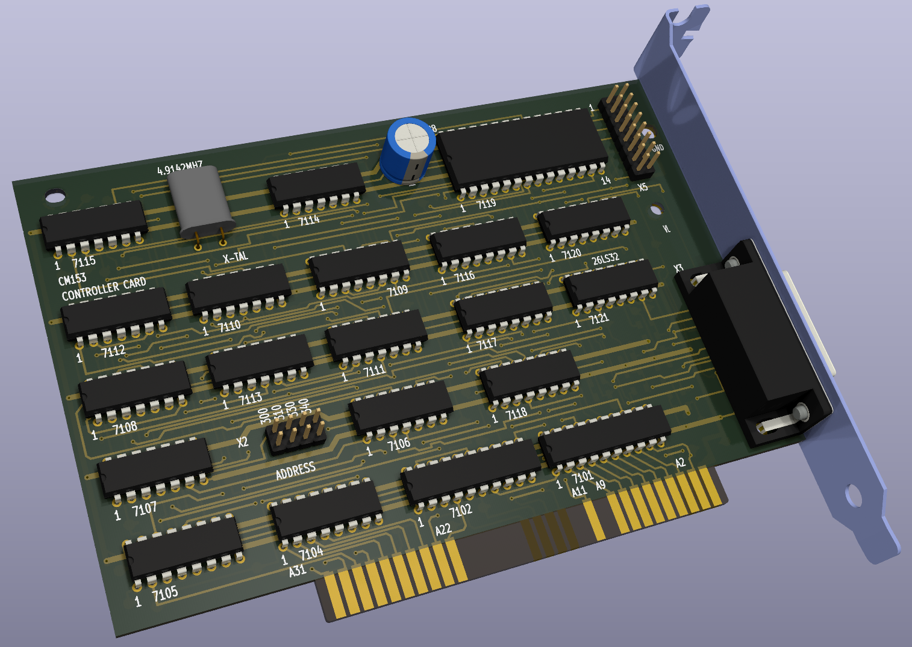

 # Philips CM-153 LMSI Reproduction Card

 
This project aims to reproduce the LMSI CM-153 card needed to operate a Philips CM-100 CD-ROM drive. This drive was originally released in 1985 and used an early version of the LSMI protocol to connect. Later versions of LMSI cards, such as the CM-260, are not compatible with earlier drives (I do not know what the exactly compatibilities are). So an early card is required. The CM-153 is a very uncommon part to find due to it's limited use, high cost, and the fact that it would probably be tossed out with the computer when upgraded being separated from its original drive.

Thanks to Roland who has a [working CM-100 and CM-153](https://www.youtube.com/watch?v=fj-uSWg0LOY) we have some pretty high quality reference images of what this card looks like. It uses all off the shelf 74 series logic chips and one 8251A UART controller. It should therefore be possible to recreate without needing and rare chips or ROM dumps.

## Current Status

The majority of the card has been reverse engineered at this point and a preliminary PCB has been layed out. The schematic is partially blocked out for functions but still has large sections that matched the physical layout.

## Known Errata

### Response

The response signal from the drive interface does not currently connected anywhere other than between the differential buffer and internal connector. The signal likely goes somewhere to the bottom pins of the UART but it has not yet been determined where.

## Potential Issues

### 7116, 7117 RCLK

The RCLK signal for the 7116, 7116 74HC595s appears to go under 7110 but due to the power rails it could only connect to the trace next to it. This would connect all three 595 RCLK's together which seems sensible but isn't visually verifiable. An alternative is that it connects to the via farther away with a separate signal that has very similar origins and would explain why the original via is not on top of the trace.

## Point to Point Checks to Make

### Most Critical
 - **Response** : Pin 1 of `X5` (internal drive connector) to pin 3 on `7119` (8251 UART).
 - **Clock Enable** : Pin 12 of `7121` is the active low enable line for the external drive's input buffer. It seems like it may connect to Pin 24 on 2119 which is UART DTR.

### Generally Not Visible
 - **RCLK** : Pin 12 of `7116, 7117`to pin 2 of `7110`. They are probably connected but I am unsure`
 - **Address Selector** : The top side address pins seem to all be connected to eachother but it's not visible. Also they are probably connected to pin 5 on `7107` but it cannot be seen.
 - **Data Clock** : Pin 1 on `7107` is probably for the data clock but can't be seen, it likely connect to pin 11 on `7113`
 - **Unknown Clock Related** : Pin 2 & 13 on `7107` is probably related to the data clock but can't be seen, it likely connect to pin 9 on `7113`
 - **Resistor** : The resistor under `7108` probably connects to pin 2 of the same chip on the side with the via but it cannot be seen
 - **RCLK Source** : The trace going under `7115` probably goes to pin 6 but cannot be seen. It comes from Pin 1 on `7110`
  - **UART** : The UART has a lot of traces under it that cannot be seen, the routings used here are:
    - `UART` Pin 27 to `7116` Pin 7
    - `UART` Pin 19 to `X5` Pin 3
    - `UART` Pin 25 & 9 to `7114` Pin 7
    - `X5` Pin 5 to `7121` Pin 5
    - `UART` Pin 12 to `7102` Pin 18
    - `UART` Pin 8 to `7116` Pin 15
    - `UART` Pin 2 to `7116` Pin 4
    - `UART` Pin 11 to `7105` Pin 14

## Parts List
|RefDes|Part Number| Datasheet|
--- | --- | ---|
|7101|PC74HCT245P|https://archive.org/details/74HCHCT245|
|7102|PC74HCT244P|https://assets.nexperia.com/documents/data-sheet/74HC_HCT244.pdf|
|7104,7105|PC74HCT138P|https://archive.org/details/74HCT138|
|7106|PC74HC08P|https://archive.org/details/manuallib-id-2654066|
|7107,7108|PC74HC32P|https://assets.nexperia.com/documents/data-sheet/74HC_HCT32.pdf|
|7109|PC74HC368P|https://assets.nexperia.com/documents/data-sheet/74HC_HCT368.pdf|
|7110|PC74HC04P|https://assets.nexperia.com/documents/data-sheet/74HC_HCT04.pdf|
|7111|PC74HC125P|https://assets.nexperia.com/documents/data-sheet/74HC_HCT125.pdf|
|7112,7113|PC74HC74P|https://assets.nexperia.com/documents/data-sheet/74HC_HCT74.pdf|
|7114,7115|PC74HC4024P|https://assets.nexperia.com/documents/data-sheet/74HC4024.pdf|
|7116,7117,7118|MC74HC595AN|https://assets.nexperia.com/documents/data-sheet/74HC_HCT595.pdf|
|7119|P8251A|http://map.grauw.nl/resources/midi/intel_8251.pdf|
|7120|DS26LS31CN|https://www.ti.com/lit/ds/symlink/am26ls31.pdf|
|7121|DS26LS32CN|https://www.ti.com/lit/ds/symlink/am26ls32am.pdf|
|X-TAL|4.9152MHz||
|Big cap|50V 10uF||
|X5|2x8 pin IDC||
|X2|2x4 pin IDC||
|Y3|15 pin D-Sub||
