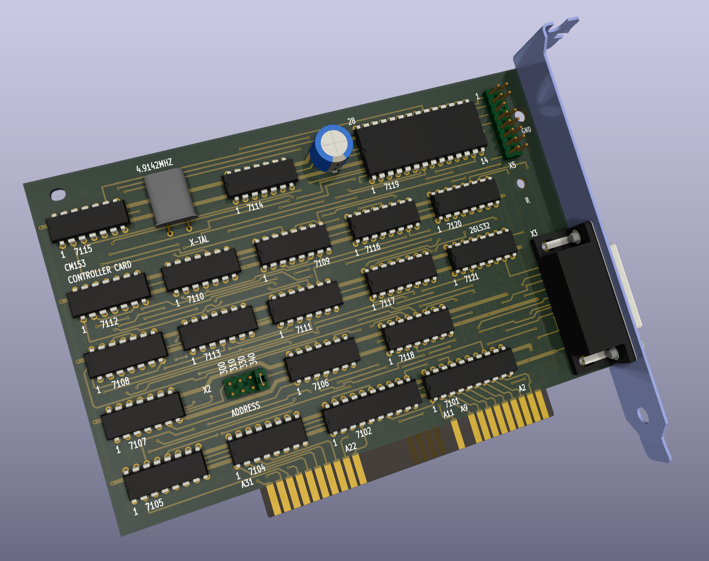

# Philips CM-153 LMSI Reproduction Card

 
This project aims to reproduce the LMSI CM-153 card needed to operate a Philips CM-100 CD-ROM drive. This drive was originally released in 1985 and used an early version of the LSMI protocol to connect. Later versions of LMSI cards, such as the CM-260, are not compatible with earlier drives (I do not know what the exactly compatibilities are). So an early card is required. The CM-153 is a very uncommon part to find due to it's limited use, high cost, and the fact that it would probably be tossed out with the computer when upgraded being separated from its original drive.

Thanks to Roland who has a [working CM-100 and CM-153](https://www.youtube.com/watch?v=fj-uSWg0LOY) we have some pretty high quality reference images of what this card looks like. It uses all off the shelf 74 series logic chips and one 8251A UART controller. It should therefore be possible to recreate without needing and rare chips or ROM dumps.

## Current Status

The card has been fully reverse engineered and all hidden traces have been hand verified on original card to be correct. A physical board will be produced soon and tested. The BOM has not been finalized but will be next.

## Parts List

*(Parts picked on 2022-09-07 and reflected best available stock)*

|RefDes|Original Part Number| Datasheet| Digikey Part| Mouser Part|
--- | --- | ---| ---| ---|
|7101|PC74HCT245P|[Datasheet](https://assets.nexperia.com/documents/data-sheet/74HC_HCT245.pdf)|[CD74HCT245E](https://www.digikey.com/en/products/detail/texas-instruments/CD74HCT245E/38454)|[SN74HCT245NE4](https://www.mouser.com/ProductDetail/Texas-Instruments/SN74HCT245NE4?qs=SL3LIuy2dWzrNeCJprt44g%3D%3D)|
|7102|PC74HCT244P|[Datasheet](https://assets.nexperia.com/documents/data-sheet/74HC_HCT244.pdf)|[CD74HCT244E](https://www.digikey.com/en/products/detail/texas-instruments/CD74HCT244E/38450)|[CD74HCT244E](https://www.mouser.com/ProductDetail/Texas-Instruments/CD74HCT244E?qs=Zu35EjizYSQlHH5t78bA9Q%3D%3D)|
|7104,7105|PC74HCT138P|[Datasheet](https://archive.org/details/74HCT138)|[CD74HCT138E](https://www.digikey.com/en/products/detail/texas-instruments/CD74HCT138E/38262)|[CD74HCT138E](https://www.mouser.com/ProductDetail/Texas-Instruments/CD74HCT138E?qs=IEl3ej0IqwCH%2FZM9hy22Dg%3D%3D)|
|7106|PC74HC08P|[Datasheet](https://archive.org/details/manuallib-id-2654066)|[TC74HC08APF](https://www.digikey.com/en/products/detail/toshiba-semiconductor-and-storage/TC74HC08APF/870461)|[SN74HC08AN](https://www.mouser.com/ProductDetail/Texas-Instruments/SN74HC08AN?qs=byeeYqUIh0O9MyGywGYg%252Bw%3D%3D)|
|7107,7108|PC74HC32P|[Datasheet](https://assets.nexperia.com/documents/data-sheet/74HC_HCT32.pdf)|**!M!**[NTE74HC32](https://www.digikey.com/en/products/detail/nte-electronics-inc/NTE74HC32/11650138)|[SN74HC32N](https://www.mouser.com/ProductDetail/Texas-Instruments/SN74HC32N?qs=tJ5HNKWh3OWs99bm2e8RtQ%3D%3D)|
|7109|PC74HC368P|[Datasheet](https://assets.nexperia.com/documents/data-sheet/74HC_HCT368.pdf)|[SN74HC368N](https://www.digikey.com/en/products/detail/texas-instruments/SN74HC368N/376786)|[SN74HC368N](https://www.mouser.com/ProductDetail/Texas-Instruments/SN74HC368N?qs=7KMwW2o1%252BmQFMEJMMaje4Q%3D%3D)|
|7110|PC74HC04P|[Datasheet](https://assets.nexperia.com/documents/data-sheet/74HC_HCT04.pdf)|[SN74HC04N](https://www.digikey.com/en/products/detail/texas-instruments/SN74HC04N/277212)|[SN74HC04AN](https://www.mouser.com/ProductDetail/Texas-Instruments/SN74HC04AN?qs=byeeYqUIh0N6S9uYkR6RCw%3D%3D)|
|7111|PC74HC125P|[Datasheet](https://assets.nexperia.com/documents/data-sheet/74HC_HCT125.pdf)|[CD74HC125E](https://www.digikey.com/en/products/detail/texas-instruments/CD74HC125E/475901)|[SN74HC125NE4](https://www.mouser.com/ProductDetail/Texas-Instruments/SN74HC125NE4?qs=AgY10sKTvDLokkOrwnzHmA%3D%3D)|
|7112,7113|PC74HC74P|[Datasheet](https://assets.nexperia.com/documents/data-sheet/74HC_HCT74.pdf)|NOT AVAILABLE|[CD74HC74EE4](https://www.mouser.com/ProductDetail/Texas-Instruments/CD74HC74EE4?qs=xFfolx0DHx2A6AZK2ZbvuQ%3D%3D)|
|7114,7115|PC74HC4024P|[Datasheet](https://assets.nexperia.com/documents/data-sheet/74HC4024.pdf)|[CD74HC4024E](https://www.digikey.com/en/products/detail/texas-instruments/CD74HC4024E/376737)|[CD74HC4024E](https://www.mouser.com/ProductDetail/Texas-Instruments/CD74HC4024E?qs=pt%2FIv5r0EPeVxf9RvRS8Kg%3D%3D)|
|7116,7117,7118|MC74HC595AN|[Datasheet](https://assets.nexperia.com/documents/data-sheet/74HC_HCT595.pdf)|[CD74HC595E](https://www.digikey.com/en/products/detail/texas-instruments/CD74HC595E/1507396)|[SN74HC595NE4](https://www.mouser.com/ProductDetail/Texas-Instruments/SN74HC595NE4?qs=AgY10sKTvDK0jki9CKjSwg%3D%3D)|
|7119|P8251A|[Datasheet](http://map.grauw.nl/resources/midi/intel_8251.pdf)|NOT AVAILABLE|NOT AVAILABLE|
|7120|DS26LS31CN|[Datasheet](https://www.ti.com/lit/ds/symlink/am26ls31.pdf)|NOT AVAILABLE|[AM26LS31CN](https://www.mouser.com/ProductDetail/Texas-Instruments/AM26LS31CN?qs=mTHRaKC2c7NO%252BlWH6D4lHg%3D%3D)|
|7121|DS26LS32CN|[Datasheet](https://www.ti.com/lit/ds/symlink/am26ls32am.pdf)|[AM26LS32ACN](https://www.digikey.com/en/products/detail/texas-instruments/AM26LS32ACN/277026)|[AM26LS32ACN](https://www.mouser.com/ProductDetail/Texas-Instruments/AM26LS32ACN?qs=IF4wzcbwb3oK65Lb3k1iHg%3D%3D)|
|X-TAL|4.9152MHz||[MP042](https://www.digikey.com/en/products/detail/cts-frequency-controls/MP042/67676)|[MP042](https://www.mouser.com/ProductDetail/CTS-Electronic-Components/MP042?qs=Mr%252BgrRYddfqYTabPpjTZhQ%3D%3D)|
|Big cap (C9)|50V 10uF||[ECA-1HHG100B](https://www.digikey.com/en/products/detail/panasonic-electronic-components/ECA-1HHG100B/413608)|[ECA-1HHG100B](https://www.mouser.com/ProductDetail/Panasonic/ECA-1HHG100B?qs=86KMePBwEH3eLbQCzM6gng%3D%3D)|
|X5|2x8 pin IDC||2x [826656-2](https://www.digikey.com/en/products/detail/te-connectivity-amp-connectors/826656-2/2276228)|2x [826656-2](https://www.mouser.com/ProductDetail/TE-Connectivity/826656-2?qs=DbJIyW2JsP7yZR%252BsE22lHg%3D%3D)|
|X2|2x4 pin IDC||[826656-2](https://www.digikey.com/en/products/detail/te-connectivity-amp-connectors/826656-2/2276228)|[826656-2](https://www.mouser.com/ProductDetail/TE-Connectivity/826656-2?qs=DbJIyW2JsP7yZR%252BsE22lHg%3D%3D)|
|Y3|15 pin D-Sub||[D15S13B4GX00LF](https://www.digikey.com/en/products/detail/amphenol-cs-fci/D15S13B4GX00LF/1539503)|[D15S13B4GX00LF](https://www.mouser.com/ProductDetail/Amphenol-FCI/D15S13B4GX00LF?qs=V0y2QjpmBGTkGk8fxG40%2FA%3D%3D)|
|C1, C2, C3, C8|100nF||[C1206C104K5RAC7800](https://www.digikey.com/en/products/detail/kemet/C1206C104K5RAC7800/411248)|[C1206C104K5RAC](https://www.mouser.com/ProductDetail/KEMET/C1206C104K5RAC?qs=utjsALNw%2FXTrbYrRGHNW%2Fw%3D%3D)|
|C4|33pF||[885012008020](https://www.digikey.com/en/products/detail/w%C3%BCrth-elektronik/885012008020/5453728)|[885012008020](https://www.mouser.com/ProductDetail/Wurth-Elektronik/885012008020?qs=0KOYDY2FL291ofVgKwDyIQ%3D%3D)|
|C5, C6|14pF||[885012008038](https://www.digikey.com/en/products/detail/w%C3%BCrth-elektronik/885012008038/5453737)|[885012008038]https://www.mouser.com/ProductDetail/Wurth-Elektronik/885012008038?qs=0KOYDY2FL2%252BQ%252BIYq9i7pEA%3D%3D)|
|C7|47pF||[885012008021](https://www.digikey.com/en/products/detail/w%C3%BCrth-elektronik/885012008021/5453729)|[885012008021](https://www.mouser.com/ProductDetail/Wurth-Elektronik/885012008021?qs=0KOYDY2FL2%2F%252Bm93ZHe2ewg%3D%3D)|
|R1|10KΩ||[RMCF1206JT10K0](https://www.digikey.com/en/products/detail/stackpole-electronics-inc/RMCF1206JT10K0/1757427)|[RC1206FR-1310KL](https://www.mouser.com/ProductDetail/YAGEO/RC1206FR-1310KL?qs=sGAEpiMZZMvdGkrng054t8AJgcdMkx7xV9EP%2FUfQrjQ%3D)|
|R2|1MΩ||[HV73V2BTTD105J](https://www.digikey.com/en/products/detail/koa-speer-electronics-inc/HV73V2BTTD105J/11495356)|[RC1206JR-071ML](https://www.mouser.com/ProductDetail/YAGEO/RC1206JR-071ML?qs=sGAEpiMZZMvdGkrng054t8Tx25L%252BvTaRR%252BfTyDGULRs%3D)|
|R3|100Ω||[RNCP1206FTD100R](https://www.digikey.com/en/products/detail/stackpole-electronics-inc/RNCP1206FTD100R/2240316)|[RC1206JR-07100RL](https://www.mouser.com/ProductDetail/YAGEO/RC1206JR-07100RL?qs=sGAEpiMZZMvdGkrng054t8Tx25L%252BvTaRBgLzIJA%2FMIc%3D)|
|R4|1KΩ||[RMCF1206JT1K00](https://www.digikey.com/en/products/detail/stackpole-electronics-inc/RMCF1206JT1K00/1757526)|[RC1206FR-131KL](https://www.mouser.com/ProductDetail/YAGEO/RC1206FR-131KL?qs=sGAEpiMZZMvdGkrng054t8AJgcdMkx7xEX6WAGFcbHI%3D)|
|R5, R6, R7, R8|120Ω||[RMCF1206JT120R](https://www.digikey.com/en/products/detail/stackpole-electronics-inc/RMCF1206JT120R/1757405)|[RC1206FR-07120RL](https://www.mouser.com/ProductDetail/YAGEO/RC1206FR-07120RL?qs=sGAEpiMZZMvdGkrng054t8AJgcdMkx7xHngnO2SPVlk%3D)|
|R10, R12, R14, R16|270Ω||[MCR18ERTJ271](https://www.digikey.com/en/products/detail/rohm-semiconductor/MCR18ERTJ271/2796388)|[RC1206FR-07270RL](https://www.mouser.com/ProductDetail/YAGEO/RC1206FR-07270RL?qs=sGAEpiMZZMvdGkrng054t8AJgcdMkx7xeAVb6tXWI0g%3D)|
|R9, R11, R13, R15|220Ω||[RMCF1206JT220R](https://www.digikey.com/en/products/detail/stackpole-electronics-inc/RMCF1206JT220R/1757377)|[AC1206JR-07220RL](https://www.mouser.com/ProductDetail/YAGEO/AC1206JR-07220RL?qs=sGAEpiMZZMvdGkrng054t7zOzNqIRvGc5GFE1pYUTcM%3D)|
|Card Bracket|Bottom DB15 Cutout|[9200-11](https://www.digikey.com/en/products/detail/keystone-electronics/9200-11/2746684)|[9200-11](https://www.mouser.com/ProductDetail/Keystone-Electronics/9200-11?qs=%252BU2dxLPlMC0AIccOWCwv6Q%3D%3D)|

*All SMD parts 1206 size.*
